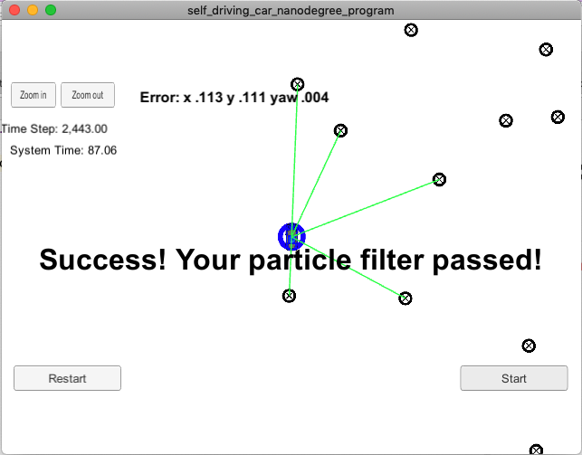

# Vehicle Localization with Particle Filter

This project implements a Particle Filter to localize a vehicle based 
on the sensor measurements of the landmarks coming from a simulator. 
The measurements are converted to the map coordinates and are associated
to the closest landmarks in the given map data.  The particle weights are 
updated based on the difference between the observed measurements
and associated landmark positions.  In the last step, the particles are
re-sampled (picked with replacement), choosing the most probable ones based on 
their weight.  The heavier particles are selected more often than the lighter
ones.  The result of re-sampling is a subset of particles with some of them 
repeated quite often.

Simulator checks and displays the result of the localization based on the 
heaviest particle.

The blue circle is the heavies particle generated by the filter.
During the run of the simulator, the blue circle moves moves closer 
and further from the true car position per random re-sampling.

To run the project and for more details refer to the original Udacity
[README](./README_orig.md).